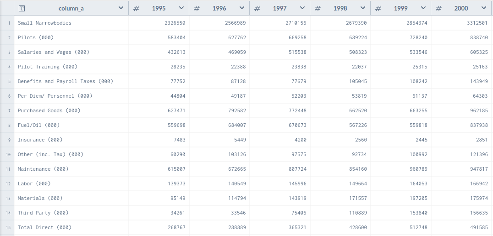
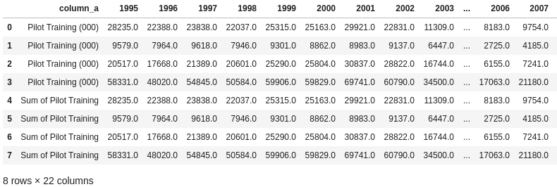
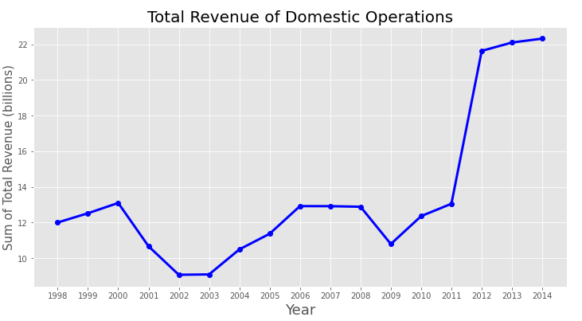
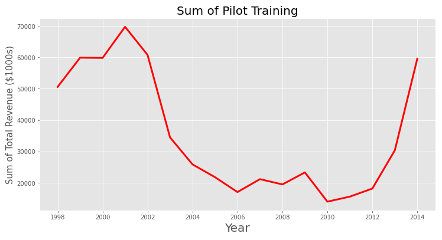
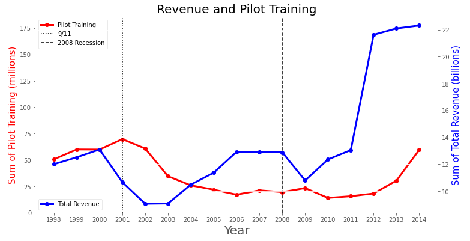
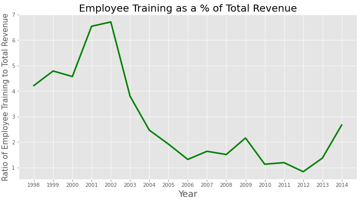

## **The Airline Industry and the Economy - Timely Effects of United Airlines General Operations**
Capstone 1 - Shaheer Khan

\
 

## Overview
United Airlines is the world’s largest commercial airline by destinations served.  The airline industry can often provide insights to the domestic economy, demonstrating trends in consumer spending and emotional behavior.  Using data-sets acquired from data.world, I was able to parse topics of interest residing in the following tables using Pandas DataFrames and SQL Queries:

- **Traffic & Capacity**
- Airline Operating Statistics
- **Aircraft Operating Statistics**
- Employee Data and Analysis

\
 

## Revenue

- 5 year effects period due to 9/11
- 2008 recession alongside swine flu
- Growth proceeding 2008 recession
- Boom in air travel

\
 
<!----> 

## Employee

- Employee growth did not receive same effects
- Greater focus towards governmental security?
- Fraction of new hires
- Airlines pocketed savings

\
 

## Combined

- Pilot Training possesses a lag effect
- Pilot training never reached pre 9/11 levels
- Airline savings?

\
 

## Ratio Analysis

- Revenue boom not met with same investment in pilot training
- Golden age of air travel
- Enticing shareholders
- Validity of Comparison

\
 

## Further Analysis

- How can projections of future economy details be used to gauge industry volatility?
- Visualizing effects of switching from turboprops to jet engines.