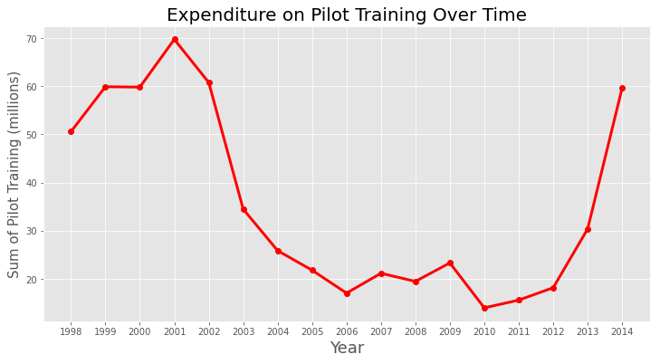

## **The Airline Industry and the Economy - Timely Effects of United Airlines General Operations**
Capstone 1 - Shaheer Khan

## Overview
United Airlines is the world’s largest commercial airline by destinations served.  The airline industry can often provide insights to the domestic economy, demonstrating trends in consumer spending and emotional behavior.  Using data-sets acquired from data.world, I was able to parse topics of interest residing in the following tables:

- **Traffic & Capacity**
- Airline Operating Statistics
- **Aircraft Operating Statistics**
- Employee Data and Analysis

\
 
## Average View Count per Country

- 5 year effects period due to 9/11
- 2008 recession alongside swine flu
- Growth proceeding 2008 recession
- Boom in air travel
\
\
\
\
 
<!----> 

- Employee growth did not receive same effects
- Focus was greater towards governmental security
- Fraction of new hires
- Airlines allegedly pocketed savings
\
\
\
\
 
## Further Analysis

- How did jet fuel costs affect ticket costs, and in turn total revenue?
- How can the history of further economy details be used to gauge industry volatility?
- Visualizing effects of switching to jet engines from turboprops.